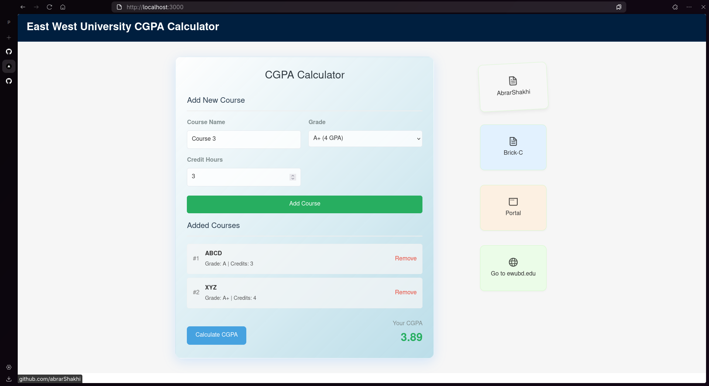

# EWU CGPA Calculator 🎓

## Deployed Link
[https://ewu-cgpa-calculator.vercel.app/](https://ewu-cgpa-calculator.vercel.app/)

----

A modern web application built with Next.js to calculate East West University students's CGPA.


## ✨ Features

- 📊 Calculate CGPA with ease
- 🎯 Support for all EWU grading systems
- 📱 Responsive design for all devices
  <!-- - 🌙 Dark mode support -->
  <!-- - 💾 Save and load previous calculations -->
  <!-- - 📈 Track academic progress -->

## 📸 Screenshots



## 🚀 Getting Started

### Prerequisites

- Node.js 18.x or later
- Yarn package manager

### Installation

1. Clone the repository:

```bash
git clone https://github.com/Abrarshakhi/ewu-cgpa-calculator.git
cd ewu-cgpa-calculator
```

2. Install dependencies:

```bash
yarn install
```

3. Run the development server:

```bash
yarn dev
```

4. Open [http://localhost:3000](http://localhost:3000) in your browser to see the result.

## 🛠️ Built With

- [Next.js](https://nextjs.org/) - The React framework for production
- [TypeScript](https://www.typescriptlang.org/) - For type safety
- [Tailwind CSS](https://tailwindcss.com/) - For styling
- [ESLint](https://eslint.org/) - For code linting
- [Prettier](https://prettier.io/) - For code formatting

## 📝 License

This project is licensed under the MIT License - see the [LICENSE](LICENSE) file for details.

## 🤝 Contributing

Contributions, issues, and feature requests are welcome! Feel free to check the [issues page](https://github.com/Abrarshakhi/ewu-cgpa-calculator/issues).

### ❤️ Honorable Contributors
1. [Tamjid](https://github.com/Brick-C)

## 📧 Contact

<!-- Your Name - [@yourtwitter](https://twitter.com/you-->

Project Link: [https://github.com/Abrarshakhi/ewu-cgpa-calculator](https://github.com/Abrarshakhi/ewu-cgpa-calculator)

---

Made with ❤️ for EWU students
